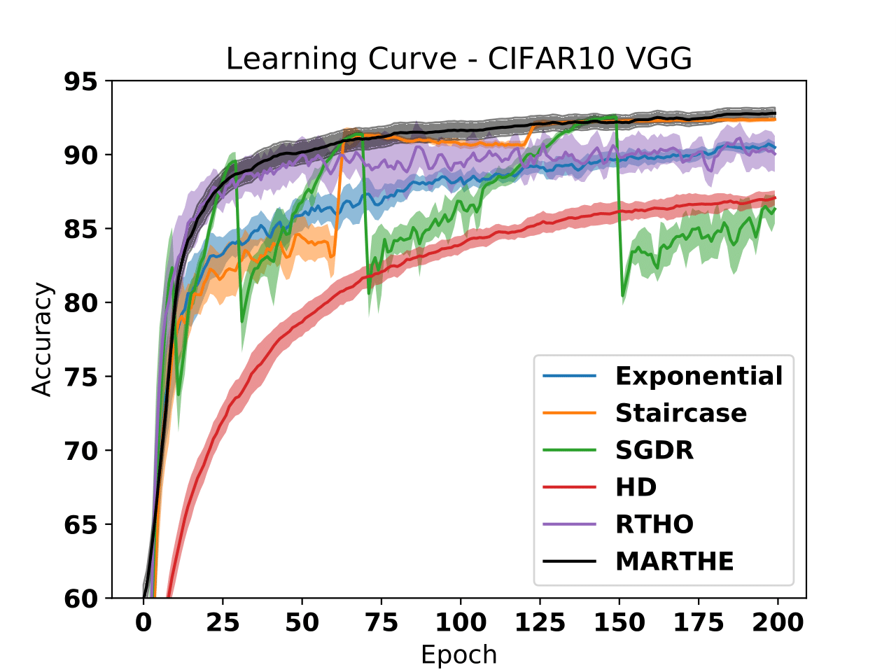
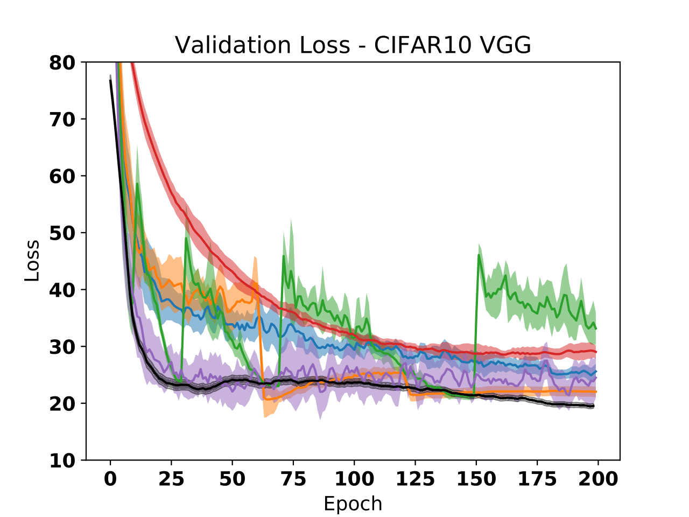
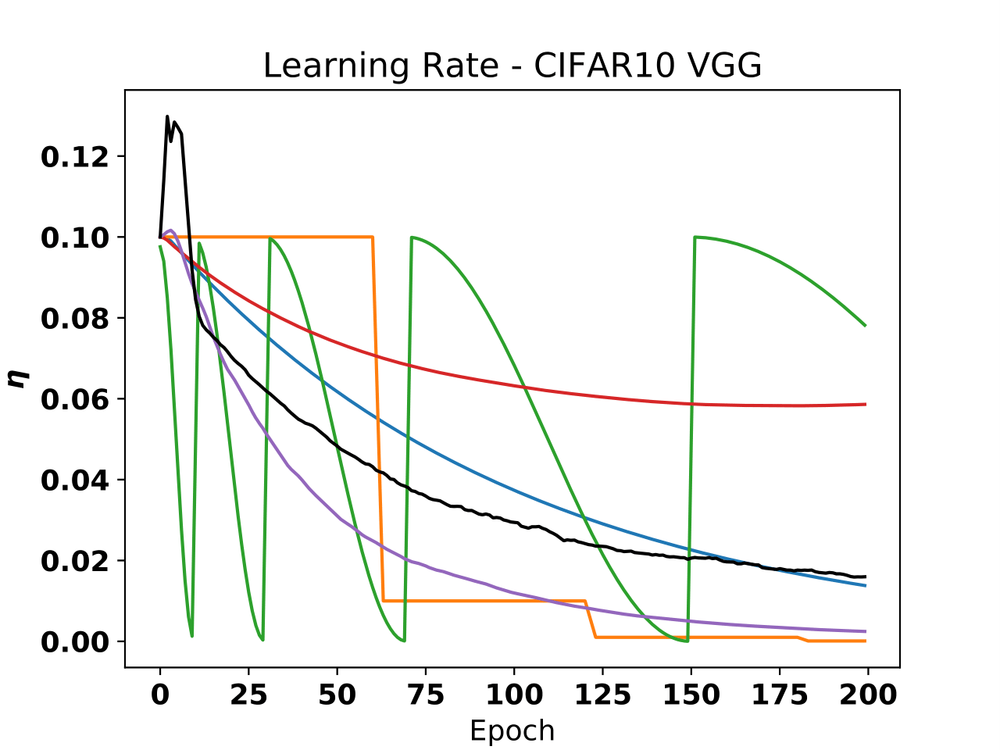
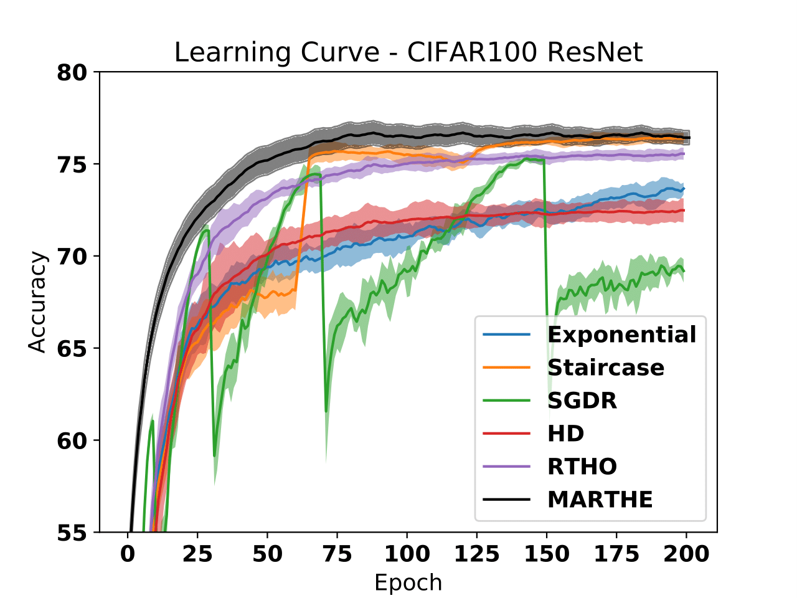
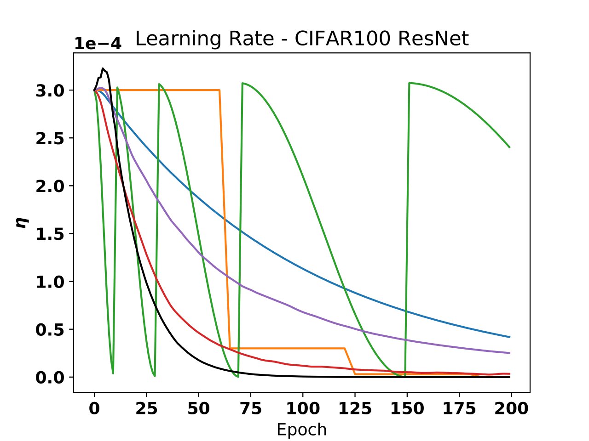

AdaTune
=======

AdaTune is a library to perform gradient based hyperparameter tuning for training deep neural networks. AdaTune currently supports tuning of the `learning_rate` parameter but some of the methods implemented here can be extended to other hyperparameters like `momentum` or `weight_decay` etc. AdaTune provides the following gradient based hyperparameter tuning algorithms -  [HD](https://arxiv.org/abs/1703.04782), [RTHO](http://proceedings.mlr.press/v70/franceschi17a.html) and our newly proposed algorithm, [MARTHE](https://arxiv.org/abs/1910.08525). The repository also contains other commonly used non-adaptive `learning_rate` adaptation strategies like staircase-decay, exponential-decay and cosine-annealing-with-restarts. The library is implemented in PyTorch. 

Mathematical Formulation of the Problem
=======================================
The goal of the methods in this package is to automatically compute in an online fashion
a learning rate schedule for stochastic optimization
methods (such as SGD) only on the basis of the given learning task, aiming at producing models
with associated small validation error.

Theoretically, we have to solve the problem of finding a learning rate (LR) schedule under the framework of  gradient-based hyperparameter optimization.
In this sense, we consider as an optimal schedule 
a solution to the following constrained optimization problem:


for ,
where  is an objective function,
 is a (possibly stochastic) weight update dynamics,
 represents the initial model weights (parameters) and finally
 are the weights after t iterations. 

We can think of E as either the training or the validation loss of the model,
while the dynamics  describe the update rule (such as SGD, SGD-Momentum, Adam etc.). For example in the case of SGD,
while the dynamics  with
 the (possibly regularized) training loss
on the t-th minibatch. The horizon T should be large enough so that
the training error can be effectively minimized, in order to avoid underfitting.
Note that a too large value of T does not necessarily harm since 
for \bar{T}" title="\Large k>\bar{T}" /> is still a feasible solution, implementing early stopping in
this setting.

Installation
============
The library can be installed (from source) like this:

```
git checkout https://github.com/awslabs/adatune.git
cd adatune
python setup.py install
```


Usage
=====
You can easily replace a non-adaptive `learning_rate` based training procedure with an adaptive one (RTHO/MARTHE) like this:

Non Adaptive
------------
```
loss.backward()
optimizer.step()
```

Adaptive
--------
```
first_grad = ag.grad(loss, net.parameters(), create_graph=True, retain_graph=True)
hyper_optim.compute_hg(net, first_grad)
for params, gradients in zip(net.parameters(), first_grad):
     params.grad = gradients
optimizer.step()
hyper_optim.hyper_step(vg.val_grad(net))
```

There are two standalone Python scripts provided in the `bin` directory which show in details how to use the library. 
* `baselines.py` - This file contains all the baselines we compare against while developing **MARTHE** (apart from RTHO). The parameters defined in the `cli_def` function are self-explanatory. You can change the `learning_rate` adaptation strategy with `lr-scheduler` parameter defined there.

For example, if you want to run cosine-annealing-with-restarts for VGG-11 on CIFAR-10 with SGD-momentum as the optimizer, you can run it like this after the package is installed:

```
python bin/baselines.py --network vgg --dataset cifar_10 --optimizer sgd --momentum 0.9 --lr-scheduler cyclic
```

* `rtho.py` - This file contains the implementation RTHO and MARTHE. MARTHE is a generalization of RTHO and HD. It is implemented together with RTHO because both the algorithms share the common component of computing the Hessian-Vector-Product.

If you want to run MARTHE, HD, or RTHO, you can run it like this:

```
python bin/rtho.py --network vgg --dataset cifar_10 --optimizer sgd --momentum 0.9 --hyper-lr 1e-8
```
if you pass `mu` as 1.0, the algorithm behaves as RTHO. If you pass `mu` as 0, the algorithm is similar to HD (though the outer gradient will be computed on the validation set instead of training set). 

In order to automatically set and adapt `mu`, set it to any value less than 0.0. You can also pass a value of `mu` in the range of [0.99, 0.999] if you don't want an adaptive behavior for `mu` only. 

If you pass `alpha` equals to 0.0, the `hyper-lr` value will stay the same for the whole training procedure.

Generally, the value of `hyper-lr` should be set to minimum 3-4 scales lower for Adam when compared to SGD (w/o momentum) for all the gradient based methods.

In order to automatically set and adapt `hyper-lr`, it is possible to set the value of `alpha` positive and small (e.g. 1e-6).

You can use a linear search algorithm to gradually reduce the value of `alpha` starting from a higher value and seeing when the algorithm is not diverging. Generally, if the value of `alpha` is high for a given task, the algorithm would diverge within the first few epochs.

In future, we plan to implement a find_hyper_lr method to automatically handle the linear search over `alpha` as well (removing completely any human intervention in the whole precedure).

For both, there is a parameter called `model-loc` which determines where the trained model would be saved. Please create this directory before running the code if you are using a different directory than the current working directory.

Networks
========
`network.py` implements LeNet-5, VGG, ResNet, MLP, Wide-ResNet and DenseNet-BC. So far, experiments are mostly done with VGG-11 and ResNet-18. 

Datasets & DataLoders
=====================
List of available Datasets/DataLoaders can be found in `data_loader.py`. Currently datasets supported are MNIST, CIFAR-10 and CIFAR-100. The DataLoaders classes will download these datasets when used for the first time. 

Results comparing MARTHE and other methods
==========================================
Results of VGG-11 on CIFAR-10, and SGDM as the inner optimizer concerning: accuracy, loss of the objective function on the validation set and generated learning rate schedule for each method.




Results of ResNet-18 on CIFAR-100, and Adam as the inner optimizer concerning: accuracy, loss of the objective function on the validation set and generated learning rate schedule for each method.




For further details, please refer to the original [paper](https://arxiv.org/abs/1910.08525).

How to cite
===========
The idea of this code is from the following paper:

Donini et al. "Scheduling the Learning Rate Via Hypergradients: New Insights and a New Algorithm."
arXiv preprint arXiv:1910.08525 (2019).

Bibtex citation:
```
@article{donini2019MARTHE,
  title={Scheduling the Learning Rate Via Hypergradients: New Insights and a New Algorithm},
  author={Donini, Michele and Franceschi, Luca and Majumder, Orchid and Pontil, Massimiliano and Frasconi, Paolo},
  journal={arXiv preprint arXiv:1910.08525},
  year={2019}
}
```